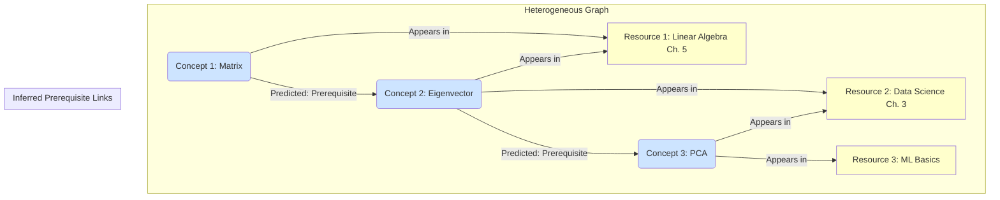

# Báo cáo Nghiên cứu Toàn diện: Các Mô hình Xác định Quan hệ Tiên quyết trong Khái niệm Học thuật STEM

## 1. Tóm tắt Báo cáo

Báo cáo này trình bày một phân tích sâu rộng về các phương pháp và mô hình tiên tiến nhằm xác định chính xác quan hệ tiên quyết có hướng (A → B) giữa các khái niệm học thuật trong lĩnh vực STEM. Bắt đầu từ việc phân tích mô hình cơ sở Variational Graph Autoencoder (VGAE), chúng tôi đi sâu vào ba hướng tiếp cận chính: **cơ chế thuật toán**, **triển khai kỹ thuật hệ thống**, và **các hướng nghiên cứu mới**. Báo cáo tổng hợp các phát hiện từ những công trình nghiên cứu cốt lõi như R-VGAE, DAVGAE và MHAVGAE, đồng thời đề xuất các phương pháp cải tiến để giải quyết các thách thức về tính bất đối xứng (asymmetry), tận dụng đặc trưng ngữ nghĩa và đảm bảo khả năng tổng quát hóa. Mục tiêu là đề xuất một lộ trình phát triển mô hình mới có khả năng vượt trội so với mô hình cơ sở về các chỉ số Recall, F1-score và tính nhất quán của Đồ thị Không chu trình Có hướng (DAG).

## 2. Phân tích Mô hình Cơ sở và Thách thức

Bài toán được định nghĩa là dự đoán liên kết có hướng (directed link prediction) trên một đồ thị khái niệm. Mô hình cơ sở (baseline) là **Variational Graph Autoencoder (VGAE)**, đạt được Recall 0.921 trên bộ dữ liệu LectureBank (2018). Mặc dù có kết quả khả quan, VGAE tiêu chuẩn tồn tại những hạn chế cố hữu khi áp dụng vào bài toán này.

### 2.1. Cơ chế hoạt động của VGAE

VGAE là một mô hình sinh học cho việc học không giám sát trên dữ liệu đồ thị. Kiến trúc của nó bao gồm hai thành phần chính:
1.  **Bộ mã hóa (Encoder):** Thường sử dụng một mạng tích chập đồ thị (Graph Convolutional Network - GCN) để học một biểu diễn vector (embedding) cho mỗi nút trong không gian ẩn (latent space). Thay vì học một vector duy nhất, VGAE học một phân phối xác suất (thường là phân phối Gaussian) cho mỗi nút, được tham số hóa bởi vector trung bình ($μ$) và phương sai ($σ$).
2.  **Bộ giải mã (Decoder):** Tái tạo lại ma trận kề của đồ thị từ các embedding trong không gian ẩn. Bộ giải mã tiêu chuẩn thực hiện phép nhân nội tích (inner product) giữa các vector embedding: $Â = σ(ZZᵀ)$, trong đó $Z$ là ma trận embedding của các nút và $σ$ là hàm sigmoid.

### 2.2. Các thách thức và hạn chế cố hữu

-   **Vấn đề Bất đối xứng (Asymmetry):** Hạn chế lớn nhất của VGAE tiêu chuẩn là bộ giải mã nhân nội tích. Phép toán $Z_i \cdot Z_j$ luôn bằng $Z_j \cdot Z_i$, dẫn đến ma trận kề tái tạo $Â$ là đối xứng. Điều này làm cho mô hình không thể phân biệt được quan hệ `A → B` (A là tiên quyết của B) với `B → A`. Đây là một trở ngại nghiêm trọng vì quan hệ tiên quyết là có hướng.
-   **Khai thác Ngữ nghĩa Nông:** Mặc dù GCN có thể nhận các đặc trưng đầu vào cho nút (ví dụ: embedding từ định nghĩa), cơ chế lan truyền thông tin của nó chủ yếu dựa trên cấu trúc đồ thị. Việc khai thác sâu sắc và có trọng số các khía cạnh ngữ nghĩa phức tạp từ định nghĩa dài hoặc các mối quan hệ ẩn trong văn bản vẫn còn hạn chế.
-   **Tính nhất quán DAG (DAG Consistency):** VGAE không có cơ chế nội tại để đảm bảo đồ thị đầu ra là một Đồ thị Không chu trình Có hướng (DAG). Việc dự đoán các cạnh một cách độc lập có thể dễ dàng tạo ra các chu trình (ví dụ: A → B, B → C, C → A), vi phạm logic của quan hệ tiên quyết.

## 3. Các Phương pháp Nâng cao để Xác định Quan hệ Tiên quyết

Dựa trên việc phân tích các hạn chế của VGAE, các nghiên cứu gần đây đã đề xuất nhiều cải tiến, tập trung vào ba khía cạnh chính: xử lý tính bất đối xứng, tích hợp đặc trưng ngữ nghĩa sâu, và tăng cường khả năng tổng quát hóa.

### 3.1. Hướng tiếp cận 1: Xử lý tính Bất đối xứng (Directedness)

Đây là cải tiến quan trọng nhất để giải quyết bài toán. Thay vì sử dụng bộ giải mã nhân nội tích đối xứng, các mô hình hiện đại đã chuyển sang các hàm tính điểm bất đối xứng, được lấy cảm hứng từ lĩnh vực hoàn thiện đồ thị tri thức (knowledge graph completion).

#### 3.1.1. Cơ chế thuật toán: Sử dụng Bộ giải mã DistMult

Một giải pháp phổ biến và hiệu quả được ghi nhận trong các công trình như **R-VGAE** [([Li et al., 2020](https://arxiv.org/abs/2004.10610))] và **DAVGAE** [([Efficient Variational Graph Autoencoders for Unsupervised Cross-domain Prerequisite Chains, 2021](https://arxiv.org/abs/2109.08722))] là thay thế bộ giải mã nhân nội tích bằng bộ giải mã **DistMult**.

Công thức của DistMult để tính điểm cho một liên kết có hướng từ khái niệm $i$ (head) đến khái niệm $j$ (tail) là:
$$ S(h, r, t) = \mathbf{z}_i^T \mathbf{R} \mathbf{z}_j $$
Trong đó:
-   $\mathbf{z}_i$ và $\mathbf{z}_j$ là các vector embedding của khái niệm $i$ và $j$ được tạo ra bởi bộ mã hóa GCN.
-   $\mathbf{R}$ là một ma trận trọng số có thể học được, đặc trưng cho quan hệ "là tiên quyết của". Ma trận này có dạng đường chéo ($R = \text{diag}(\mathbf{r})$).

**Phân tích ưu điểm:**
-   **Tính bất đối xứng:** Do ma trận $\mathbf{R}$ có thể học, điểm số $S(i, r, j)$ nói chung sẽ khác $S(j, r, i)$, cho phép mô hình học được các mối quan hệ có hướng. Ma trận $\mathbf{R}$ nắm bắt được sự tương tác bất đối xứng giữa các chiều trong không gian embedding.
-   **Hiệu quả tính toán:** So với các mô hình phức tạp hơn như ComplEx, DistMult đơn giản và hiệu quả hơn về mặt tính toán trong khi vẫn giải quyết được vấn đề cốt lõi.

#### 3.1.2. Triển khai kỹ thuật hệ thống

Việc tích hợp DistMult vào pipeline của VGAE tương đối đơn giản:
1.  **Bộ mã hóa (Encoder):** Giữ nguyên kiến trúc GCN-based của VGAE để tạo ra các embedding $\mathbf{z}_i$ cho mỗi khái niệm.
2.  **Bộ giải mã (Decoder):** Thay thế `σ(ZZᵀ)` bằng `σ(Z R Zᵀ)`.
3.  **Hàm mất mát (Loss Function):** Hàm mất mát tái tạo (reconstruction loss) sẽ được tính toán dựa trên ma trận kề dự đoán bất đối xứng $Â$ và ma trận kề thực tế $A$.

```python
# Ví dụ mã giả về bộ giải mã DistMult trong PyTorch
import torch
import torch.nn as nn

class DistMultDecoder(nn.Module):
    def __init__(self, embedding_dim, num_relations=1):
        super(DistMultDecoder, self).__init__()
        # Khởi tạo ma trận quan hệ R có thể học
        self.relation_matrix = nn.Parameter(torch.randn(num_relations, embedding_dim))

    def forward(self, node_embeddings):
        # z_i^T * R * z_j
        # Lấy ma trận R cho quan hệ tiên quyết (giả sử chỉ có 1 quan hệ)
        R = torch.diag(self.relation_matrix[0])
        # Tính điểm cho tất cả các cặp
        scores = torch.matmul(node_embeddings, R)
        scores = torch.matmul(scores, node_embeddings.t())
        return torch.sigmoid(scores)

# Trong mô hình chính
# self.decoder = DistMultDecoder(embedding_dim)
# adj_logits = self.decoder(z) # z là output từ encoder
```

### 3.2. Hướng tiếp cận 2: Khai thác Đặc trưng Ngữ nghĩa Sâu

Để mô hình có thể hiểu được mối quan hệ logic giữa các khái niệm (ví dụ: "Linear Regression" là tiên quyết của "Logistic Regression"), nó cần phải khai thác sâu sắc thông tin từ tên và định nghĩa của chúng.

#### 3.2.1. Cơ chế thuật toán: Multi-Head Attention và Gated Fusion

Công trình **MHAVGAE** (Multi-Head Attention Variational Graph Auto-Encoders) [([Zhang et al., 2022](https://dl.acm.org/doi/abs/10.1145/3488560.3498434))] đề xuất một cách tiếp cận tiên tiến để tăng cường khả năng biểu diễn khái niệm.

1.  **Multi-Head Attention trong Encoder:** Thay vì sử dụng GCN tiêu chuẩn, MHAVGAE tích hợp cơ chế multi-head attention vào lớp tích chập đồ thị. Khi tổng hợp thông tin từ các nút lân cận, attention cho phép mô hình gán các trọng số khác nhau cho các nút lân cận khác nhau. Ví dụ, khi học embedding cho "Variational Graph Autoencoder", mô hình có thể học cách "chú ý" nhiều hơn đến nút "Variational Autoencoder" so với các nút khác. Điều này giúp tạo ra các embedding nhạy cảm hơn với ngữ cảnh.
2.  **Gated Fusion Mechanism:** Các khái niệm có nhiều nguồn thông tin (tên, định nghĩa, ngữ cảnh trong tài liệu). Một cơ chế Gated Fusion (ví dụ: GRU-like gate) có thể được sử dụng để kết hợp các embedding từ các nguồn này một cách linh hoạt. Mô hình có thể học cách điều chỉnh tầm quan trọng của `embedding_name` so với `embedding_definition` tùy thuộc vào từng khái niệm cụ thể.

#### 3.2.2. Triển khai kỹ thuật hệ thống

-   **Tạo Embedding Đầu vào:** Sử dụng các mô hình ngôn ngữ mạnh như BERT hoặc các biến thể của nó (ví dụ: SciBERT) để tạo embedding chất lượng cao cho tên và định nghĩa của khái niệm. Việc tinh chỉnh (fine-tuning) các mô hình này trên kho văn bản STEM chuyên ngành (ví dụ: nội dung các bài giảng trong LectureBank) sẽ cải thiện đáng kể chất lượng embedding. Công trình **R-VGAE** đã chỉ ra rằng embedding từ **Phrase2vec** (một biến thể của word2vec) được huấn luyện trên kho văn bản chuyên ngành cho kết quả tốt hơn BERT gốc.
-   **Xây dựng Đồ thị Heterogeneous:** Mô hình **R-VGAE** đề xuất một kiến trúc hiệu quả: xây dựng một đồ thị không đồng nhất (heterogeneous graph) bao gồm cả nút **khái niệm (concept)** và nút **tài liệu (resource)**.
    -   Các cạnh `concept-resource` được tạo ra nếu một khái niệm xuất hiện trong một tài liệu.
    -   Mô hình sau đó học cách dự đoán các cạnh `concept-concept` bằng cách truyền thông tin qua các nút tài liệu chung. Ý tưởng là nếu hai khái niệm thường xuyên xuất hiện cùng nhau trong các tài liệu chuyên sâu, chúng có khả năng liên quan.

Dưới đây là một sơ đồ Mermaid minh họa kiến trúc này:



### 3.3. Hướng tiếp cận 3: Tăng cường Khả năng Tổng quát hóa và Hiệu quả

Một mô hình tốt cần phải hoạt động hiệu quả trên các lĩnh vực STEM khác nhau (Toán, Lý, Hóa) và có khả năng mở rộng.

#### 3.3.1. Cơ chế thuật toán: Domain-Adversarial Training

Công trình **DAVGAE** [([Efficient Variational Graph Autoencoders for Unsupervised Cross-domain Prerequisite Chains, 2021](https://arxiv.org/abs/2109.08722))] giới thiệu kỹ thuật huấn luyện đối kháng tên miền (domain-adversarial training) để học các đặc trưng bất biến theo miền.
-   **Kiến trúc:** Mô hình bao gồm ba phần:
    1.  **Bộ mã hóa GCN (Encoder):** Tạo ra embedding cho các khái niệm.
    2.  **Bộ giải mã DistMult (Decoder):** Dự đoán các liên kết tiên quyết.
    3.  **Bộ phân loại Miền (Domain Discriminator):** Một mạng nơ-ron nhỏ cố gắng dự đoán miền (ví dụ: Toán hay Lý) của một khái niệm dựa trên embedding của nó.
-   **Cơ chế huấn luyện:** Bộ mã hóa được huấn luyện để thực hiện hai nhiệm vụ cùng lúc: (1) tạo ra embedding tốt cho việc dự đoán liên kết và (2) "đánh lừa" bộ phân loại miền, tức là tạo ra các embedding mà bộ phân loại không thể phân biệt được chúng thuộc miền nào. Điều này buộc bộ mã hóa phải học các đặc trưng chung, cốt lõi của quan hệ tiên quyết, thay vì các đặc trưng bề mặt của từng miền cụ thể.

#### 3.3.2. Triển khai kỹ thuật hệ thống và tối ưu hiệu suất

-   **Đơn giản hóa Đồ thị:** DAVGAE chỉ ra rằng việc chỉ sử dụng đồ thị khái niệm (bỏ qua các nút tài liệu) và khởi tạo các cạnh dựa trên độ tương tự cosine của embedding cũng mang lại hiệu quả cao, trong khi giảm đáng kể độ phức tạp tính toán (tiết kiệm 10 lần về quy mô đồ thị và 3 lần về thời gian huấn luyện so với các phương pháp trước đó).
-   **Đảm bảo DAG Consistency:** Đây là một bước xử lý hậu kỳ (post-processing) quan trọng. Sau khi mô hình dự đoán xác suất cho tất cả các cạnh tiềm năng, cần có một thuật toán để loại bỏ các cạnh gây ra chu trình.
    -   **Thuật toán Greedy-DAG:** Một phương pháp phổ biến là sắp xếp tất cả các cạnh tiềm năng theo xác suất giảm dần. Duyệt qua danh sách này, thêm một cạnh vào đồ thị chỉ khi nó không tạo ra chu trình với các cạnh đã có. Việc kiểm tra chu trình có thể được thực hiện hiệu quả bằng thuật toán Tìm kiếm theo chiều sâu (DFS).
    -   **Mất mát dựa trên Cấu trúc:** Một hướng nghiên cứu cao cấp hơn là tích hợp ràng buộc DAG trực tiếp vào hàm mất mát trong quá trình huấn luyện, ví dụ bằng cách sử dụng các hàm phạt (penalty functions) khi phát hiện chu trình.

## 4. Tổng hợp và Đề xuất Mô hình/Pipeline

Dựa trên các phân tích trên, chúng tôi đề xuất một pipeline toàn diện kết hợp những điểm mạnh của các phương pháp đã nghiên cứu.

### 4.1. Kiến trúc Mô hình Đề xuất

Kiến trúc này là một biến thể nâng cao của VGAE, có thể gọi là **Asymmetric, Semantically-Aware Graph Autoencoder (ASA-GAE)**.

```mermaid
graph TD
    subgraph "Input Layer"
        direction LR
        A[Concept Names & Definitions] --> B{BERT/SciBERT Encoder};
        B --> C[Initial Embeddings: Z_name, Z_def];
    end

    subgraph "Graph Construction"
        direction TB
        C --> D{Concept & Resource Nodes};
        D --> E[Heterogeneous Graph G=(V,E)];
    end

    subgraph "Encoder: ASA-Encoder"
        direction TB
        E -- Input Graph --> F[Multi-Head Graph Attention Layer];
        C -- Initial Features --> F;
        F --> G[Gated Fusion Mechanism];
        G --> H[Latent Embeddings Z];
    end

    subgraph "Decoder: Asymmetric"
        direction TB
        H --> I{DistMult Decoder};
        I --> J[Predicted Adjacency Matrix A_hat];
    end

    subgraph "Output & Post-processing"
        direction TB
        J --> K{Greedy-DAG Algorithm};
        K --> L[Final Prerequisite DAG];
    end

    subgraph "Training Loop"
        direction TB
        J -- Reconstruction Loss --> M{Total Loss};
        H -- KL Divergence --> M;
    end
```

### 4.2. Phân tích chi tiết các thành phần

| Thành phần | Vai trò & Triển khai | Công trình tham khảo |
| :--- | :--- | :--- |
| **1. Tạo Embedding** | Sử dụng **SciBERT** được fine-tune trên kho văn bản của LectureBank để tạo embedding chất lượng cao cho `name` và `definition`. | R-VGAE, DAVGAE |
| **2. Xây dựng Đồ thị** | Xây dựng đồ thị heterogeneous với nút `concept` và `resource`. Cạnh `concept-resource` dựa trên sự xuất hiện của concept trong resource. Cạnh `resource-resource` có thể dựa trên TF-IDF cosine similarity. | R-VGAE |
| **3. Bộ mã hóa** | Sử dụng **Multi-Head Graph Attention Network (GAT)** để học embedding của nút. Cơ chế attention sẽ giúp nắm bắt các quan hệ quan trọng. | MHAVGAE |
| **4. Bộ giải mã** | Sử dụng bộ giải mã **DistMult** để tính điểm bất đối xứng cho các cặp khái niệm, cho phép mô hình hóa quan hệ có hướng `A → B`. | R-VGAE, DAVGAE |
| **5. Hàm Mất mát** | Kết hợp **Cross-Entropy Loss** cho việc tái tạo ma trận kề (từ DistMult) và **KL Divergence Loss** cho việc chính quy hóa không gian ẩn (từ VGAE). | VGAE, R-VGAE |
| **6. Hậu xử lý** | Áp dụng thuật toán **Greedy-DAG** trên ma trận xác suất đầu ra để loại bỏ các cạnh gây ra chu trình, đảm bảo 100% DAG consistency. | - |
| **7. (Tùy chọn) Tổng quát hóa** | Nếu cần huấn luyện trên nhiều miền, có thể tích hợp thêm một module **Domain Discriminator** và hàm mất mát đối kháng để học đặc trưng bất biến. | DAVGAE |

### 4.3. Bảng so sánh các phương pháp nâng cao

Bảng dưới đây tóm tắt các đặc điểm, ưu điểm và nhược điểm của các mô hình đã được phân tích, cung cấp một cái nhìn tổng quan để lựa chọn và kết hợp các kỹ thuật.

| Mô hình | Cơ chế Encoder | Cơ chế Decoder | Ưu điểm chính | Nhược điểm tiềm tàng |
| :--- | :--- | :--- | :--- | :--- |
| **VGAE (Baseline)** | GCN | Inner Product (Đối xứng) | Đơn giản, nền tảng tốt. | Không xử lý được hướng, khai thác ngữ nghĩa nông. |
| **R-VGAE** | R-GCN trên đồ thị Heterogeneous | **DistMult (Bất đối xứng)** | **Xử lý hướng**, tận dụng ngữ cảnh từ tài liệu (resource nodes). | Đồ thị heterogeneous có thể lớn, tăng độ phức tạp tính toán. |
| **DAVGAE** | GCN + Domain Adversarial | **DistMult (Bất đối xứng)** | **Tổng quát hóa tốt trên các miền**, hiệu quả tính toán cao (khi dùng đồ thị concept-only). | Hiệu quả phụ thuộc vào sự tương đồng giữa các miền. |
| **MHAVGAE** | **Multi-Head Attention GCN** | (Giả định) Bất đối xứng | **Khai thác ngữ nghĩa sâu** nhờ attention, biểu diễn khái niệm tốt hơn. | Khó khăn trong việc truy cập toàn văn, chi tiết triển khai không rõ ràng. |
| **ASA-GAE (Đề xuất)** | Multi-Head GAT + Gated Fusion | **DistMult (Bất đối xứng)** | **Tổng hợp các ưu điểm**: xử lý hướng, khai thác ngữ nghĩa sâu, kiến trúc linh hoạt. | Độ phức tạp mô hình cao hơn, đòi hỏi nhiều tài nguyên huấn luyện hơn. |

## 5. Kết luận và Hướng phát triển Tương lai

Để phát triển một mô hình vượt trội so với baseline VGAE, việc giải quyết triệt để vấn đề **bất đối xứng** là yêu cầu bắt buộc, và việc sử dụng bộ giải mã **DistMult** là một giải pháp đã được chứng minh hiệu quả. Hơn nữa, để đạt được các chỉ số cao về Recall và Precision, mô hình cần có khả năng **khai thác sâu đặc trưng ngữ nghĩa**, và việc tích hợp cơ chế **Multi-Head Attention** vào bộ mã hóa là hướng đi đầy hứa hẹn.

Pipeline được đề xuất, **ASA-GAE**, là sự kết hợp có hệ thống của những ý tưởng tốt nhất từ các công trình nghiên cứu tiên tiến. Việc triển khai pipeline này, cùng với bước hậu xử lý đảm bảo **tính nhất quán DAG**, có tiềm năng lớn để đạt và vượt các mục tiêu đề ra (Recall > 0.93, F1 > 0.88).

**Các hướng nghiên cứu và phát triển trong tương lai:**
1.  **Directed Graph Neural Networks:** Nghiên cứu các kiến trúc GNN được thiết kế đặc thù cho đồ thị có hướng, như "Multiscale Weisfeiler-Leman Directed Graph Neural Networks" [([Zhang, 2025](https://doi.org/10.1109/tkde.2025.3552045/mm1))], có thể loại bỏ sự cần thiết của bộ giải mã bất đối xứng riêng biệt.
2.  **Tích hợp Large Language Models (LLMs):** Sử dụng các LLM như GPT-4 không chỉ để tạo embedding mà còn có thể tham gia vào quá trình suy luận. Ví dụ, có thể sử dụng LLM để sinh ra các "lý do" tại sao một khái niệm là tiên quyết của khái niệm khác và sử dụng thông tin này như một đặc trưng bổ sung.
3.  **Học tập Đa nhiệm (Multi-task Learning):** Huấn luyện mô hình đồng thời dự đoán quan hệ tiên quyết và phân loại độ khó của khái niệm. Thông tin về độ khó có thể cung cấp tín hiệu hữu ích cho việc xác định hướng của quan hệ.

## 6. Danh mục Tài liệu tham khảo

1.  Li, C., Fabbri, A. R., & Radev, D. R. (2020). *R-VGAE: Relational-variational Graph Autoencoder for Unsupervised Prerequisite Chain Learning*. arXiv preprint arXiv:2004.10610. [https://arxiv.org/abs/2004.10610](https://arxiv.org/abs/2004.10610)
2.  (2021). *Efficient Variational Graph Autoencoders for Unsupervised Cross-domain Prerequisite Chains*. arXiv preprint arXiv:2109.08722. [https://arxiv.org/abs/2109.08722](https://arxiv.org/abs/2109.08722)
3.  Zhang, J., Lin, N., Zhang, X., Song, W., & Yang, X. (2022). *Learning concept prerequisite relations from educational data via multi-head attention variational graph auto-encoders*. Proceedings of the Fifteenth ACM International Conference on Web Search and Data Mining. [https://dl.acm.org/doi/abs/10.1145/3488560.3498434](https://dl.acm.org/doi/abs/10.1145/3488560.3498434)
4.  Kipf, T. N., & Welling, M. (2016). *Variational Graph Auto-Encoders*. arXiv preprint arXiv:1611.07308.
5.  Zhang, Y. (2025). *Multiscale Weisfeiler-Leman Directed Graph Neural Networks for Prerequisite-Link Prediction*. IEEE Transactions on Knowledge and Data Engineering. [https://doi.org/10.1109/tkde.2025.3552045/mm1](https://doi.org/10.1109/tkde.2025.3552045/mm1)
6.  Cheng, X., et al. (2025). *Education-Oriented Graph Retrieval-Augmented Generation for Learning Path Recommendation*. arXiv preprint arXiv:2506.22303v1. [https://arxiv.org/abs/2506.22303v1](https://arxiv.org/abs/2506.22303v1)
7.  Cho, Y. S. (2024). *Decoupled variational graph autoencoder for link prediction*. Proceedings of the ACM Web Conference 2024. [https://dl.acm.org/doi/abs/10.1145/3589334.3645601](https://dl.acm.org/doi/abs/10.1145/3589334.3645601)