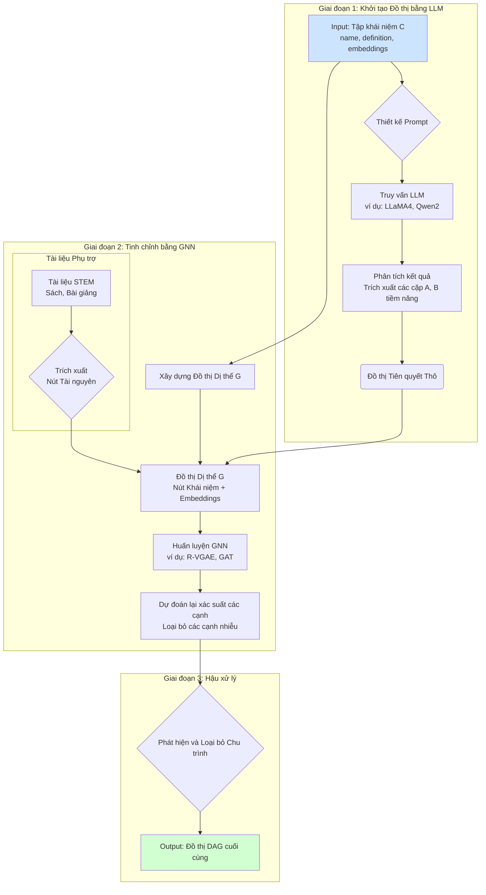

# Nghiên cứu và Phát triển Mô hình Học sâu Xác định Quan hệ Tiên quyết giữa các Khái niệm Học tập STEM

**Ngày:** Tháng 11, 2025

## Tóm tắt Báo cáo

Báo cáo này trình bày một phân tích toàn diện về các phương pháp học sâu hiện đại để tự động xác định mối quan hệ tiên quyết (A → B) giữa các khái niệm học tập trong lĩnh vực STEM. Mục tiêu là xây dựng một đồ thị có hướng không chu trình (DAG) từ một tập hợp các khái niệm, mỗi khái niệm được cung cấp dưới dạng tên, định nghĩa và các biểu diễn ngữ nghĩa (embedding). Dựa trên quá trình rà soát và phân tích các tài liệu nghiên cứu chuyên sâu, hai hướng tiếp cận chính đã được xác định: **(1) Mô hình Ngôn ngữ Lớn (LLM) cho dự đoán zero-shot** và **(2) Mạng Nơ-ron Đồ thị (GNN) cho học quan hệ không giám sát hoặc bán giám sát**.

Báo cáo đi sâu vào cơ chế thuật toán, chi tiết kỹ thuật triển khai hệ thống, và các hướng nghiên cứu mới nổi cho từng phương pháp. Các kết quả từ những bài báo tiên phong như Le et al. (2025) và Huang et al. (2020) đã được tổng hợp để cung cấp một cái nhìn đa chiều. Báo cáo đề xuất một **kiến trúc lai (hybrid)** kết hợp sức mạnh suy luận ngữ nghĩa của LLM để tạo dữ liệu ban đầu và khả năng học cấu trúc của GNN để tinh chỉnh và hoàn thiện đồ thị quan hệ. Cuối cùng, báo cáo đưa ra lộ trình phát triển, các phương pháp đánh giá, và thảo luận về các bộ dữ liệu quan trọng, nhằm cung cấp một nền tảng vững chắc cho việc nghiên cứu và triển khai một hệ thống hiệu quả trong thực tế.

---

## 1. Giới thiệu và Định nghĩa Bài toán

Trong bối cảnh giáo dục STEM ngày càng phát triển, việc xây dựng các lộ trình học tập cá nhân hóa và hiệu quả trở nên vô cùng quan trọng. Một yếu tố cốt lõi của lộ trình học tập là cấu trúc phụ thuộc giữa các khái niệm: một học viên cần nắm vững khái niệm A trước khi có thể hiểu được khái niệm B. Việc xác định các mối quan hệ tiên quyết này theo cách thủ công bởi các chuyên gia là một quá trình tốn nhiều thời gian, chi phí và khó mở rộng. Do đó, việc phát triển các phương pháp tự động sử dụng học sâu để giải quyết bài toán này mang lại tiềm năng to lớn.

### 1.1. Định nghĩa Bài toán
Bài toán tập trung vào việc phát triển một mô hình học sâu có khả năng nhận dạng chính xác mối quan hệ tiên quyết có hướng giữa các khái niệm học thuật.

*   **Đầu vào:** Một tập hợp các khái niệm `C = {c₁, c₂, ..., cₙ}` đã được trích xuất từ các tài liệu học tập (ví dụ: sách giáo khoa, bài giảng). Mỗi khái niệm `cᵢ` bao gồm các thông tin sau:
    *   `name`: Tên của khái niệm (ví dụ: "Tích phân", "Học Máy").
    *   `definition`: Một đoạn văn bản ngắn mô tả hoặc định nghĩa khái niệm.
    *   `embedding_name`, `embedding_definition`, `embedding_{name+def}`: Các vector biểu diễn ngữ nghĩa (embedding) đã được mã hóa sẵn từ tên, định nghĩa và sự kết hợp của cả hai.

*   **Đầu ra:** Một tập hợp các cặp quan hệ có hướng `(A, B)`, trong đó khái niệm `A` là điều kiện tiên quyết để học khái niệm `B`. Kết quả cuối cùng được biểu diễn dưới dạng một **Đồ thị Có hướng Không chu trình (Directed Acyclic Graph - DAG)**, nơi mỗi nút là một khái niệm và mỗi cạnh có hướng thể hiện một mối quan hệ tiên quyết.

### 1.2. Mục tiêu và Thách thức
Mục tiêu chính là xây dựng một hệ thống tự động, chính xác và có khả năng mở rộng để tạo ra các đồ thị tri thức này từ dữ liệu văn bản. Các thách thức chính bao gồm:
*   **Tính tinh vi của quan hệ:** Quan hệ tiên quyết không chỉ dựa trên sự tương đồng ngữ nghĩa mà còn phụ thuộc vào logic sư phạm và cấu trúc tri thức của lĩnh vực.
*   **Sự khan hiếm dữ liệu có nhãn:** Việc thu thập một bộ dữ liệu lớn với các cặp quan hệ tiên quyết được gán nhãn bởi chuyên gia là rất khó khăn.
*   **Đảm bảo tính không chu trình (DAG):** Kết quả cuối cùng phải là một DAG hợp lệ, đòi hỏi các thuật toán xử lý và loại bỏ chu trình hiệu quả.

## 2. Các Hướng Tiếp cận Thuật toán Chính

Dựa trên các nghiên cứu khoa học được khảo sát, hai họ mô hình học sâu chính nổi lên như những ứng cử viên hàng đầu để giải quyết bài toán này. Mỗi họ có cơ chế hoạt động, ưu điểm và nhược điểm riêng.

### 2.1. Tiếp cận 1: Mô hình Ngôn ngữ Lớn (LLM) cho Dự đoán Zero-Shot

Hướng tiếp cận này khai thác khả năng suy luận và kiến thức nền tảng khổng lồ được tích hợp sẵn trong các Mô hình Ngôn ngữ Lớn (LLM) hiện đại như GPT-4, LLaMA, Claude và Gemini.

#### 2.1.1. Cơ chế Thuật toán
Phương pháp này hoạt động trong môi trường "zero-shot", nghĩa là mô hình có thể thực hiện nhiệm vụ mà không cần được huấn luyện lại trên dữ liệu dành riêng cho tác vụ đó. Quá trình này dựa vào kỹ thuật **prompt engineering**.

Bài báo "How Well Do LLMs Predict Prerequisite Skills? Zero-Shot Comparison to Expert-Defined Concepts" của [Le et al. (2025)](https://arxiv.org/abs/2507.18479v1) đã chứng minh tính hiệu quả của phương pháp này. Cơ chế hoạt động như sau:
1.  **Thiết kế Prompt:** Một prompt (câu lệnh) được cấu trúc cẩn thận để yêu cầu LLM thực hiện vai trò của một chuyên gia giáo dục. Prompt này chứa tên (`name`) và định nghĩa (`definition`) của khái niệm mục tiêu. Ví dụ:
    > "List the essential prerequisite concepts or foundational knowledge areas needed to begin learning the skill: ‘Machine Learning’. Skill Description: ‘The ability to design algorithms that learn patterns from data and make predictions’. Respond only with a comma-separated list."
2.  **Suy luận của LLM:** LLM sử dụng kiến thức đã học từ hàng terabyte dữ liệu văn bản để phân tích ngữ nghĩa của khái niệm mục tiêu và suy luận ra các khái niệm cơ bản cần có trước.
3.  **Trích xuất Kết quả:** Đầu ra của LLM (thường là một danh sách văn bản) được phân tích cú pháp để trích xuất các khái niệm tiên quyết. Mỗi khái niệm được trích xuất sẽ tạo thành một cạnh có hướng `(prerequisite_concept → target_concept)`.

Nghiên cứu của Le et al. (2025) đã đánh giá 13 LLM hàng đầu và chỉ ra rằng các mô hình như LLaMA4-Maverick, Qwen2-72B, và Claude-3.7-Sonnet đạt được điểm số F1-BERTScore cao (lần lượt là 0.8347, 0.8262, và 0.8256) khi so sánh với dữ liệu chuyên gia từ bộ benchmark ESCO-PrereqSkill.

#### 2.1.2. Bảng so sánh hiệu suất các LLM (Dựa trên Le et al., 2025)
Bảng dưới đây tổng hợp hiệu suất của một số LLM nổi bật được đánh giá trong nghiên cứu, sử dụng các chỉ số BERTScore và Semantic Similarity (Sim_sem).

| Model | F1_BERT | Precision_BERT | Recall_BERT | Sim_sem | Latency (s) |
| :--- | :---: | :---: | :---: | :---: | :---: |
| **LLaMA4-Maverick** | **0.8347** | 0.8291 | 0.8403 | 0.6125 | < 2.0 |
| **Qwen2-72B** | 0.8262 | 0.8155 | 0.8371 | 0.6098 | ~3.0-4.0 |
| **LLaMA4-Scout** | 0.8256 | 0.8201 | 0.8312 | 0.6151 | < 2.0 |
| **Gemini-2.0-Flash** | 0.8238 | 0.8310 | 0.8167 | 0.6049 | < 2.0 |
| **Claude-3.7-Sonnet** | 0.8194 | 0.8123 | 0.8265 | **0.6189** | ~2.0-3.0 |
| **GPT-4.5-Preview** | 0.8150 | 0.8012 | 0.8291 | 0.6110 | ~7.04 |
| **DeepSeek-R1** | 0.8011 | 0.7854 | 0.8173 | 0.5987 | ~16.09 |
*Bảng 1: So sánh hiệu suất dự đoán kỹ năng tiên quyết của các LLM. Dữ liệu được diễn giải từ kết quả của Le et al. (2025). Các giá trị chính xác là từ bài báo, latency được ước tính dựa trên mô tả.*

### 2.2. Tiếp cận 2: Mạng Nơ-ron Đồ thị (GNN) cho Học Quan hệ

Hướng tiếp cận này mô hình hóa tập hợp các khái niệm và tài liệu liên quan thành một đồ thị và sử dụng sức mạnh của GNN để học các mối quan hệ tiềm ẩn giữa các nút.

#### 2.2.1. Cơ chế Thuật toán
Phương pháp này coi việc xác định quan hệ tiên quyết như một bài toán **dự đoán liên kết (link prediction)** trên đồ thị. Các bài báo quan trọng trong lĩnh vực này bao gồm "R-VGAE: Relational-variational Graph Autoencoder for Unsupervised Prerequisite Chain Learning" của [Huang et al. (2020)](https://arxiv.org/abs/2004.10610) và "A graph neural network model for concept prerequisite relation extraction" của [Mazumder et al. (2023)](https://dl.acm.org/doi/abs/10.1145/3583780.3614761).

Cơ chế hoạt động của mô hình R-VGAE (một đại diện tiêu biểu) như sau:
1.  **Xây dựng Đồ thị Dị thể (Heterogeneous Graph):** Một đồ thị lớn được tạo ra, bao gồm hai loại nút chính:
    *   **Nút Khái niệm (Concept Nodes):** Từ tập `C` được cung cấp.
    *   **Nút Tài nguyên (Resource Nodes):** Các tài liệu, bài giảng, hoặc các đoạn văn bản mà từ đó các khái niệm được trích xuất.
    Các loại cạnh bao gồm: `concept-resource` (khái niệm xuất hiện trong tài nguyên), và `resource-resource` (sự tương đồng giữa các tài nguyên). Cạnh `concept-concept` (quan hệ tiên quyết) là mục tiêu cần dự đoán và sẽ *không* được sử dụng trong quá trình huấn luyện không giám sát.
2.  **Khởi tạo Đặc trưng Nút:**
    *   Đối với các nút khái niệm, các embedding được cung cấp (`embedding_name`, `embedding_definition`, `embedding_{name+def}`) được sử dụng trực tiếp làm vector đặc trưng ban đầu.
    *   Đối với các nút tài nguyên, đặc trưng có thể được tính bằng TF-IDF hoặc các mô hình embedding văn bản như Sentence-BERT.
3.  **Mô hình R-VGAE:**
    *   **Bộ mã hóa (Encoder):** Sử dụng một **Relational Graph Convolutional Network (R-GCN)** để mã hóa cấu trúc đồ thị và đặc trưng của các nút thành một không gian tiềm ẩn (latent space), tạo ra các vector embedding `Z` cho mỗi nút. R-GCN có khả năng xử lý nhiều loại cạnh khác nhau.
    *   **Bộ giải mã (Decoder):** Sử dụng một hàm tính điểm, ví dụ như **DistMult**, để tái tạo lại ma trận kề từ các embedding `Z`. Cụ thể, điểm số cho một cặp `(A, B)` được tính, thể hiện xác suất tồn tại của cạnh quan hệ tiên quyết.
    $$ \text{score}(A, B) = Z_A^T \cdot R \cdot Z_B $$
    trong đó $R$ là một ma trận trọng số quan hệ có thể học được.
4.  **Huấn luyện:** Mô hình được huấn luyện để tối thiểu hóa hàm mất mát, bao gồm mất mát tái tạo (so sánh ma trận kề dự đoán với ma trận kề thực tế - chỉ bao gồm các cạnh đã biết như `concept-resource`) và mất mát KL-divergence để điều chuẩn không gian tiềm ẩn.
5.  **Dự đoán Liên kết:** Sau khi huấn luyện, mô hình có thể dự đoán xác suất tồn tại của các cạnh `concept-concept` chưa từng thấy.

Huang et al. (2020) cho thấy mô hình R-VGAE không giám sát của họ vượt trội hơn các phương pháp bán giám sát và các đường cơ sở khác, với độ chính xác và F1-score cao hơn tới 9.77% và 10.47%.

#### 2.2.2. So sánh các phương pháp học quan hệ
Bảng dưới đây so sánh các phương pháp tiếp cận khác nhau để học quan hệ tiên quyết.

| Phương pháp | Loại Mô hình | Dữ liệu Huấn luyện | Ưu điểm | Nhược điểm |
| :--- | :--- | :--- | :--- | :--- |
| **LLM Zero-Shot** | Transformer (LLM) | Dữ liệu huấn luyện khổng lồ của LLM | Không cần dữ liệu nhãn A→B, tốc độ phát triển nhanh, khai thác kiến thức rộng lớn. | Có thể "ảo giác", phụ thuộc vào chất lượng prompt, chi phí API cao. |
| **R-VGAE** | GNN (Autoencoder) | Đồ thị dị thể (khái niệm, tài nguyên) | Không giám sát (không cần nhãn A→B), khai thác cấu trúc, có thể giải thích được hơn. | Cần xây dựng đồ thị phức tạp, hiệu suất phụ thuộc vào chất lượng đồ thị đầu vào. |
| **GAT-based** | GNN (Attention) | Đồ thị dị thể | Sử dụng cơ chế attention để học trọng số các nút lân cận, hiệu suất cao. | Thường yêu cầu một phần dữ liệu có nhãn (bán giám sát) để đạt hiệu quả tốt nhất. |
| **Feature-based** | SVM, Random Forest | Các đặc trưng thủ công (TF-IDF, Wikipedia links, ...) | Đơn giản, dễ triển khai. | Phụ thuộc nặng vào kỹ thuật trích xuất đặc trưng, khó mở rộng và khái quát hóa. |
*Bảng 2: So sánh các lớp mô hình cho bài toán xác định quan hệ tiên quyết.*

## 3. Triển khai Hệ thống và Kiến trúc Đề xuất

Để xây dựng một hệ thống hoàn chỉnh, cần kết hợp các cơ chế thuật toán với một quy trình kỹ thuật rõ ràng, từ tiền xử lý dữ liệu đến hậu xử lý kết quả. Dựa trên phân tích, một **kiến trúc lai (hybrid)** được đề xuất để tận dụng ưu điểm của cả hai hướng tiếp cận LLM và GNN.

### 3.1. Sơ đồ Kiến trúc Hệ thống Lai
Sơ đồ dưới đây mô tả một kiến trúc lai tiềm năng, kết hợp LLM và GNN.

*Sơ đồ 1: Kiến trúc hệ thống lai đề xuất.*

### 3.2. Chi tiết các bước triển khai

1.  **Giai đoạn 1: Khởi tạo Đồ thị bằng LLM (Tạo "Nhãn Yếu")**
    *   **Mục tiêu:** Nhanh chóng tạo ra một phiên bản đồ thị ban đầu với độ phủ cao.
    *   **Thực thi:**
        *   Sử dụng phương pháp zero-shot như mô tả ở mục 2.1.
        *   Lặp qua tất cả các khái niệm trong `C`, sử dụng LLM để tạo ra một danh sách các khái niệm tiên quyết tiềm năng cho mỗi khái niệm.
        *   Các cặp `(prerequisite, target)` được tạo ra sẽ đóng vai trò là các "nhãn yếu" (weak labels), có thể chứa nhiễu nhưng cung cấp một cấu trúc khởi đầu tốt hơn nhiều so với việc bắt đầu từ con số không.

2.  **Giai đoạn 2: Tinh chỉnh Đồ thị bằng GNN**
    *   **Mục tiêu:** Sử dụng GNN để học cấu trúc sâu hơn của đồ thị, xác thực các liên kết do LLM tạo ra và loại bỏ các liên kết nhiễu.
    *   **Thực thi:**
        *   **Xây dựng đồ thị dị thể:**
            *   Các nút khái niệm được khởi tạo với các `embedding` đã cho.
            *   Các nút tài nguyên được tạo từ các tài liệu học tập gốc.
            *   Các cạnh `concept-resource` được thêm vào nếu một khái niệm được đề cập trong một tài liệu.
        *   **Huấn luyện GNN (chế độ bán giám sát):**
            *   Sử dụng các cạnh "nhãn yếu" từ LLM làm dữ liệu huấn luyện cho mô hình GNN (ví dụ: R-VGAE hoặc GAT). Điều này biến bài toán từ không giám sát thành bán giám sát, giúp mô hình hội tụ tốt hơn.
            *   GNN sẽ học cách phân biệt các mối quan hệ hợp lý và không hợp lý dựa trên cả ngữ nghĩa (từ embedding) và cấu trúc (từ các đường đi trên đồ thị).
        *   **Dự đoán lại:** Sau khi huấn luyện, sử dụng GNN để tính toán lại xác suất cho tất cả các cạnh `concept-concept` tiềm năng. Áp dụng một ngưỡng tin cậy để giữ lại các cạnh có xác suất cao.

3.  **Giai đoạn 3: Hậu xử lý và Tạo DAG**
    *   **Mục tiêu:** Đảm bảo đồ thị cuối cùng là một DAG hợp lệ.
    *   **Thực thi:**
        *   Áp dụng các thuật toán phát hiện chu trình, ví dụ như Thuật toán Tarjan hoặc tìm kiếm theo chiều sâu (DFS) cải tiến.
        *   Khi phát hiện một chu trình (ví dụ: A→B, B→C, C→A), một cạnh cần được loại bỏ. Cạnh có xác suất thấp nhất do GNN dự đoán sẽ là ứng cử viên hàng đầu để loại bỏ.

## 4. Hướng Nghiên cứu và Phát triển Tương lai

Lĩnh vực này vẫn còn nhiều không gian để cải tiến và khám phá, dựa trên những nền tảng đã được xây dựng.

*   **Tích hợp Đa phương thức (Multi-modality):** Các tài liệu STEM thường chứa hình ảnh, công thức toán học và sơ đồ. Nghiên cứu của [Li et al. (2022)](https://www.mdpi.com/2078-2489/13/2/91) về `MEduKG` cho thấy việc xây dựng đồ thị tri thức đa phương thức là một hướng đi hứa hẹn. Các mô hình trong tương lai có thể kết hợp embedding từ văn bản, hình ảnh (sử dụng mô hình Vision Transformer) và công thức (sử dụng LaTeX-BERT) để có một sự hiểu biết toàn diện hơn.

*   **Học Chủ động (Active Learning):** Để giảm thiểu chi phí gán nhãn, có thể áp dụng học chủ động. Mô hình sẽ xác định các cặp khái niệm mà nó "không chắc chắn" nhất về mối quan hệ của chúng và yêu cầu chuyên gia con người gán nhãn cho chỉ những cặp này. Bài báo của [Liang et al. (2018)](https://ojs.aaai.org/index.php/AAAI/article/view/11396) đã đề cập đến việc áp dụng active learning cho bài toán này.

*   **Sử dụng Không gian Hyperbolic:** Quan hệ tiên quyết có bản chất phân cấp. Đồ thị phân cấp có thể được biểu diễn hiệu quả hơn trong không gian hyperbolic so với không gian Euclid thông thường. Các mô hình GNN trên không gian hyperbolic, như đề xuất trong [Li (2025)](https://doi.org/10.1007/s44196-025-00738-2), có thể nắm bắt cấu trúc này tốt hơn.

*   **Học hỏi qua Chương trình (Curriculum Learning):** Thay vì huấn luyện mô hình trên tất cả dữ liệu cùng một lúc, có thể áp dụng curriculum learning: bắt đầu với các mối quan hệ "dễ" và dần dần chuyển sang các mối quan hệ "khó" hơn. Các bài báo như [Guo et al. (2022)](https://arxiv.org/abs/2205.08625) đã cho thấy phương pháp này giúp cải thiện hiệu suất trong các tác vụ trích xuất quan hệ.

## 5. Kết luận

Việc tự động xác định quan hệ tiên quyết giữa các khái niệm học tập là một bài toán đầy thách thức nhưng có giá trị ứng dụng cao. Báo cáo này đã tổng hợp và phân tích các phương pháp học sâu tiên tiến, tập trung vào hai hướng chính là LLM zero-shot và GNN.

*   **LLM** cung cấp một giải pháp nhanh chóng, không yêu cầu dữ liệu gán nhãn và tận dụng được kho kiến thức khổng lồ có sẵn.
*   **GNN** lại mạnh về việc học các mẫu cấu trúc phức tạp từ dữ liệu, cho phép tinh chỉnh và xác thực các mối quan hệ một cách có hệ thống.

**Kiến trúc lai** được đề xuất kết hợp điểm mạnh của cả hai phương pháp: sử dụng LLM để khởi tạo một đồ thị "nháp" và sau đó dùng GNN để "gọt giũa" và hoàn thiện nó. Cách tiếp cận này hứa hẹn mang lại một hệ thống vừa có độ chính xác cao, vừa có khả năng mở rộng. Các hướng phát triển trong tương lai như tích hợp đa phương thức và học chủ động sẽ tiếp tục nâng cao hiệu quả và tính ứng dụng của các mô hình này trong việc xây dựng các nền tảng giáo dục thông minh và cá nhân hóa.

## 6. Tài liệu tham khảo

1.  **Le, N. L., & Abel, M.-H. (2025).** *How Well Do LLMs Predict Prerequisite Skills? Zero-Shot Comparison to Expert-Defined Concepts*. arXiv preprint arXiv:2507.18479. [https://arxiv.org/abs/2507.18479v1](https://arxiv.org/abs/2507.18479v1)
2.  **Huang, J., et al. (2020).** *R-VGAE: Relational-variational Graph Autoencoder for Unsupervised Prerequisite Chain Learning*. arXiv preprint arXiv:2004.10610. [https://arxiv.org/abs/2004.10610](https://arxiv.org/abs/2004.10610)
3.  **Mazumder, D., Paik, J. H., & Basu, A. (2023).** *A graph neural network model for concept prerequisite relation extraction*. Proceedings of the 32nd ACM International Conference on Information and Knowledge Management. [https://dl.acm.org/doi/abs/10.1145/3583780.3614761](https://dl.acm.org/doi/abs/10.1145/3583780.3614761)
4.  **Li, N., et al. (2022).** *MEduKG: A Deep-Learning-Based Approach for Multi-Modal Educational Knowledge Graph Construction*. Information, 13(2), 91. [https://www.mdpi.com/2078-2489/13/2/91](https://www.mdpi.com/2078-2489/13/2/91)
5.  **Liang, C., et al. (2018).** *Investigating Active Learning for Concept Prerequisite Learning*. Proceedings of the AAAI Conference on Artificial Intelligence. [https://ojs.aaai.org/index.php/AAAI/article/view/11396](https://ojs.aaai.org/index.php/AAAI/article/view/11396)
6.  **Guo, Z., et al. (2022).** *Generic and Trend-aware Curriculum Learning for Relation Extraction in Graph Neural Networks*. arXiv preprint arXiv:2205.08625. [https://arxiv.org/abs/2205.08625](https://arxiv.org/abs/2205.08625)
7.  **Xia, X., & Qi, W. (2024).** *The construction of knowledge graphs based on associated STEM concepts in MOOCs and its guidance for sustainable learning behaviors*. Education and Information Technologies. [https://link.springer.com/article/10.1007/s10639-024-12653-8](https://link.springer.com/article/10.1007/s10639-024-12653-8)
8.  **Li, J. (2025).** *Hyperbolic Graph Convolutional Network Relation Extraction Model Combining Dependency Syntax and Contrastive Learning*. International Journal of Computational Intelligence Systems, 18(1). [https://doi.org/10.1007/s44196-025-00738-2](https://doi.org/10.1007/s44196-025-00738-2)
9.  **Chen, P., et al. (2018).** *Knowedu: A system to construct knowledge graph for education*. IEEE Access. [https://ieeexplore.ieee.org/abstract/document/8362657/](https://ieeexplore.ieee.org/abstract/document/8362657/)